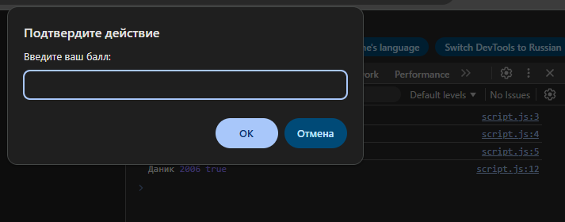
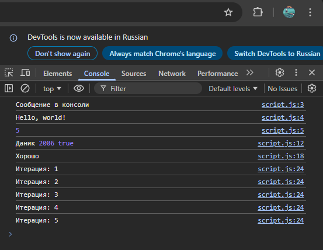

# Лабораторная работа 1

## Инструкции по запуску проекта

1. Установить текстовый редактор, например Visual Studio Code (Visual Studio Code).
2. Установить Node.js (Node.js) с официального сайта.
3. Создать папку проекта и в ней два файла: index.html и script.js.
4. В файл index.html вставить HTML-код страницы и подключить внешний файл через тег  в разделе <head>.
5. В файл script.js вставить JavaScript-код лабораторной работы.
6. Открыть файл index.html в браузере.
7. Открыть инструменты разработчика для просмотра вывода console.log.
8. Дополнительно можно проверить выполнение отдельных команд (например, console.log("Hello, world!"); и 2 + 3) прямо в консоли браузера или через Node.js в терминале.

Описание лабораторной работы
Цель работы - познакомиться с основами JavaScript, научиться писать и выполнять код в браузере и в локальной среде, а также разобраться с базовыми конструкциями языка.
В ходе выполнения лабораторной были изучены:
- выполнение JavaScript-кода в консоли браузера;
- создание HTML-страницы со встроенным скриптом;
- подключение внешнего JavaScript-файла;
- работа с переменными и типами данных;
- использование условных операторов;
- использование циклов.

## Краткая документация к проекту

Проект состоит из двух основных файлов:

1. index.html - HTML-документ, который подключает внешний файл script.js.
2. script.js - содержит весь JavaScript-код лабораторной работы.

Функциональные возможности проекта:
- вывод сообщений через alert и console.log;
- выполнение арифметического выражения 2 + 3;
- объявление переменных разных типов (string, number, boolean);
- ввод данных пользователем через prompt;
- проверка условий с помощью if / else if / else;
- выполнение цикла for с пятью итерациями.

## Примеры использования проекта с приложением фрагментов кода

### Пример 1. Выполнение кода в консоли браузера:

console.log("Hello, world!");
2 + 3

### Пример 2. Подключение внешнего файла:

  

### Пример 3. Объявление переменных:

let name = "Даник";
let birthYear = 2006;
let isStudent = true;
console.log(name, birthYear, isStudent);

### Пример 4. Условный оператор и цикл:

let score = prompt("Введите ваш балл:");
if (score >= 90) {
console.log("Отлично!");
} else if (score >= 70) {
console.log("Хорошо");
} else {
console.log("Можно лучше!");
}

for (let i = 1; i <= 5; i++) {
console.log(`Итерация: ${i}`);
}

### Ожидаемый результат:

- при загрузке страницы появляется alert;
- в консоли отображаются сообщения и результаты вычислений;
- после ввода балла выводится соответствующая оценка;
- выводятся строки с номерами итераций от 1 до 5.

## Ответы на контрольные вопросы

1. Чем отличается var от let и const?
   var имеет функциональную область видимости и допускает повторное объявление. let имеет блочную область видимости и не допускает повторного объявления в одном блоке. const также имеет блочную область видимости, но значение переменной нельзя переопределить после инициализации.

2. Что такое неявное преобразование типов в JavaScript?
   Это автоматическое преобразование одного типа данных в другой при выполнении операций. Например, при сравнении строки и числа JavaScript может автоматически преобразовать строку в число.

3. Как работает оператор == в сравнении с ===?
   Оператор == сравнивает значения с приведением типов (может выполнять неявное преобразование).
   Оператор === сравнивает и значение, и тип данных без преобразования типов, поэтому является более строгим и предпочтительным для использования.

## Список использованных источников

1. Обучающие материалы на Utube:
[видео](https://www.youtube.com/watch?v=d4CMlsqTXN4&list=PLuY6eeDuleIMtvOvJBAbakwcIdEt7IAXT&index=9)
2. Учебные материалы по JavaScript.

## Дополнительные важные аспекты

- prompt возвращает строку, поэтому при сравнении с числами происходит неявное преобразование типов.
- Для просмотра console.log необходимо открыть вкладку Console в DevTools.
- JavaScript может выполняться как в браузере, так и в среде Node.js.
